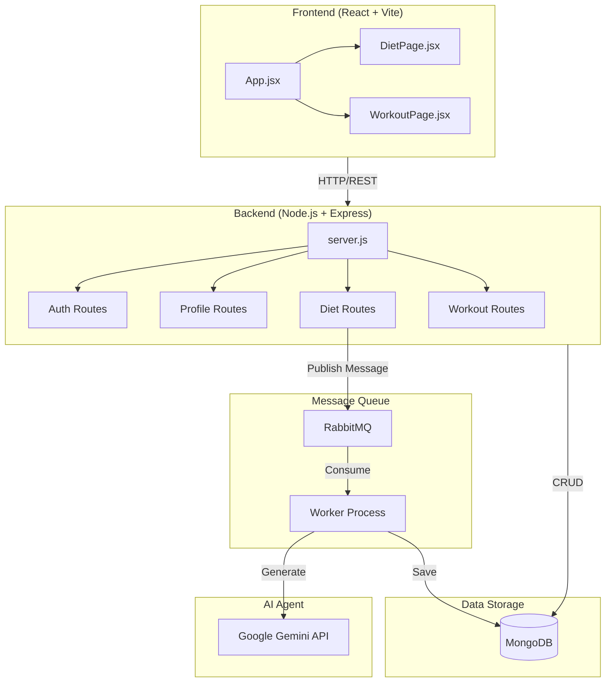
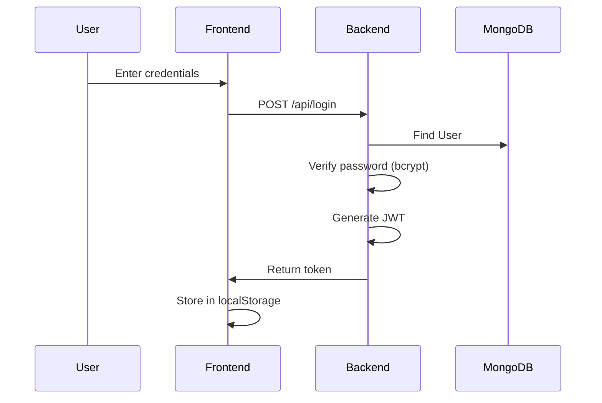
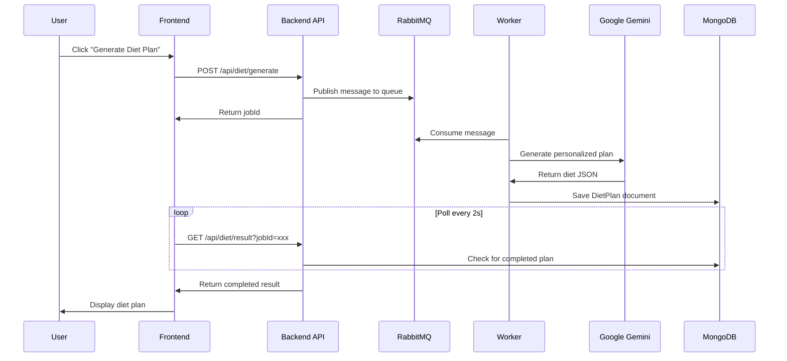
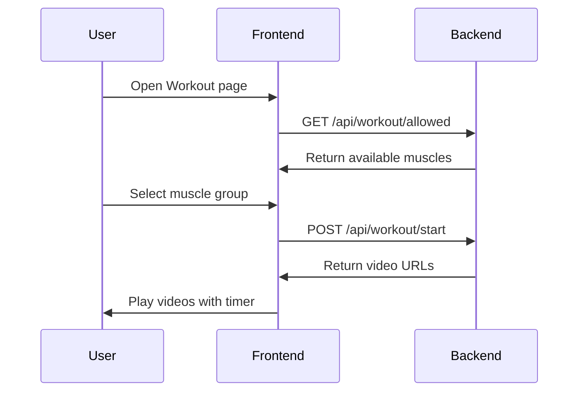

# AI Gym Trainer - Architecture Walkthrough

A comprehensive developer's guide to the application architecture, technologies, and data storage.

---

## High-Level Architecture



---

## Technology Stack

| Layer | Technology | Purpose |
|-------|------------|---------|
| **Frontend** | React 19 + Vite 7 | UI framework & build tool |
| **Routing** | React Router v7 | Client-side navigation |
| **HTTP Client** | Axios | API requests |
| **Notifications** | React Hot Toast | Toast notifications |
| **Backend** | Node.js + Express 5 | REST API server |
| **Database** | MongoDB + Mongoose 9 | Primary data storage |
| **Message Queue** | RabbitMQ | Async job processing (like Celery in Python) |
| **AI/LLM** | Google Gemini API | Diet plan generation |
| **Auth** | JWT + bcrypt | Authentication & password hashing |

---

## Data Storage at Each Level

### 1. Client-Side Storage (Browser)

| Data | Storage Method | Purpose |
|------|----------------|---------|
| Auth Token | `localStorage` | Persists login session |
| User State | React State | Current user info in memory |

```javascript
// Token stored in localStorage for session persistence
const [token, setToken] = useState(localStorage.getItem('token'));
```

---

### 2. Message Queue (RabbitMQ)

| Data | Storage Method | Purpose |
|------|----------------|---------|
| Diet Jobs | RabbitMQ Queue | Async diet plan generation |
| Job Messages | RabbitMQ | Track pending jobs |

**How it works:**
1. User requests diet plan → API publishes message to RabbitMQ queue
2. Worker process consumes messages from queue
3. Worker calls AI and saves result to MongoDB
4. Frontend polls for completion

```javascript
// Publisher (API Route)
channel.sendToQueue('diet', Buffer.from(JSON.stringify({ userId, profile })));

// Consumer (Worker)
channel.consume('diet', async (msg) => {
    const { userId, profile } = JSON.parse(msg.content.toString());
    const dietPlan = await generateDietPlan(profile);
    // Save to MongoDB...
    channel.ack(msg);
});
```

---

### 3. Database Storage (MongoDB)

#### User Model
| Field | Type | Description |
|-------|------|-------------|
| `email` | String | Unique login identifier |
| `password` | String | bcrypt-hashed password |
| `name` | String | Display name |

#### Profile Model
| Field | Type | Description |
|-------|------|-------------|
| `userId` | ObjectId | Reference to User |
| `weightKg` | Number | Weight in kg |
| `heightCm` | Number | Height in cm |
| `region` | String | Geographic region |
| `eatingHabits` | String | e.g., "Vegetarian" |
| `goal` | String | e.g., "Muscle Gain" |

#### DietPlan Model
| Field | Type | Description |
|-------|------|-------------|
| `userId` | ObjectId | Reference to User |
| `planData` | String | JSON-stringified diet plan |
| `createdAt` | Date | Generation timestamp |

---

## Application Flow by Feature

### 1. Authentication Flow



---

### 2. Diet Plan Generation Flow (RabbitMQ)



**Why RabbitMQ?**
- LLM calls take 5-15 seconds - too long for synchronous response
- RabbitMQ decouples the API from heavy processing
- Worker can process jobs independently
- Reliable message delivery with acknowledgments

---

### 3. Workout Flow



---

## Summary

| Layer | Technology | Data Stored |
|-------|------------|-------------|
| **Browser** | localStorage | JWT token |
| **Message Queue** | RabbitMQ | Pending diet jobs |
| **Database** | MongoDB | Users, Profiles, Diet Plans |
| **AI** | Google Gemini | Generates diet content |

This full-stack application follows the **producer-consumer pattern** with RabbitMQ handling async job processing, similar to how Celery works with RabbitMQ in Python applications.
